# Architecture

This document provides a visual overview of the Uptime Robot Operator architecture, including CRD relationships, controller interactions, and data flows.

## System Overview

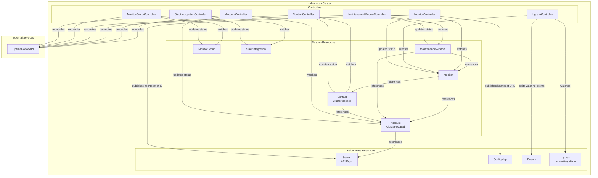

## CRD Dependency Graph

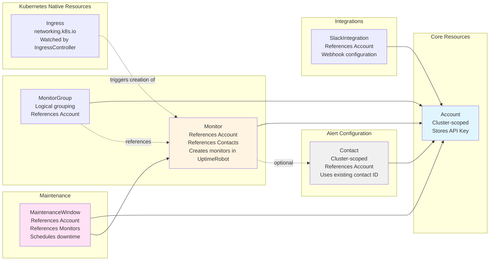

### Dependency Rules

1. **Account** and **Contact** are cluster-scoped; other managed CRDs are namespaced.
2. **Contact** reconciliation requires a resolvable Account/API key and either `spec.contact.id` or `spec.contact.name`.
3. **Monitor** reconciliation requires a resolvable Account/API key; referenced Contacts must resolve to a `status.id`.
4. **MaintenanceWindow** and **MonitorGroup** resolve monitor references in the same namespace; unresolved or not-ready monitors are skipped.
5. **IngressController** creates/updates/deletes `Monitor` resources only when ingress annotations (prefix `uptimerobot.com/`, configurable) include `enabled=true`.

## Reconciliation Flow

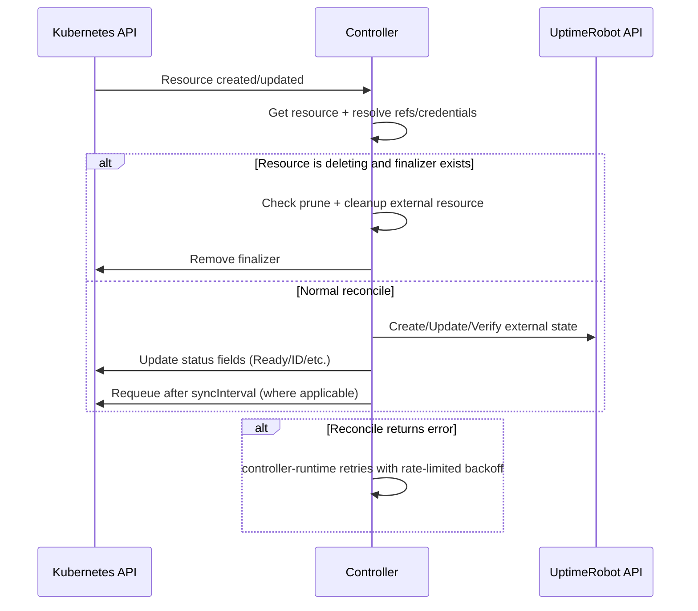

## Drift Detection

Drift handling is implemented as periodic reconciliation, and behavior varies by controller:
- **Monitor**, **MaintenanceWindow**, and **MonitorGroup** reconcile desired state to UptimeRobot on each sync interval.
- **SlackIntegration** lists integrations and recreates the Slack integration if missing or different from desired state.
- **MaintenanceWindow** and **MonitorGroup** explicitly recreate resources when backend IDs are not found.

### Drift Detection Frequency

Controlled by `syncInterval` fields (default `24h` where defined):
- Lower values = faster drift detection, more API calls
- Higher values = less API load, slower drift detection

## Finalizer and Deletion Flow (Monitor)

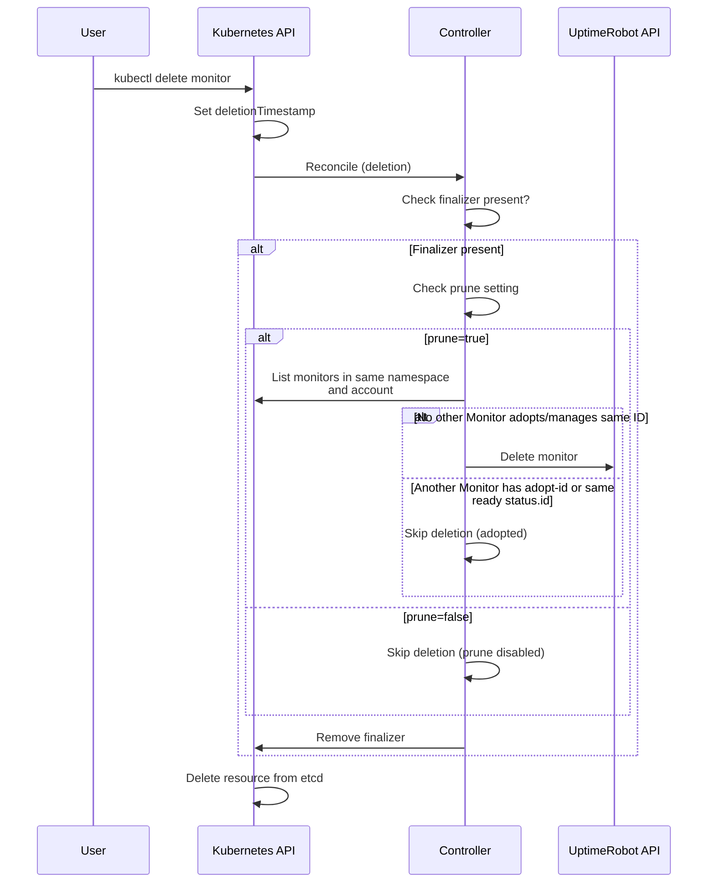

## Controller Watches

Each controller watches specific resources:

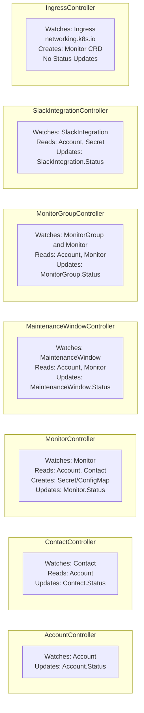

## External API Interactions

### Authentication Flow

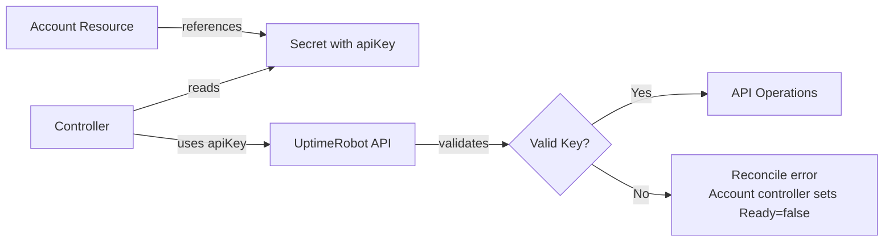

### Rate Limiting

UptimeRobot API has rate limits:
- Controllers do not implement custom client-side throttling logic in this repo
- `syncInterval` controls reconciliation frequency
- Failed reconciliations are retried with controller-runtime rate-limited backoff
- Check controller logs for rate limit errors

## Component Interactions

### Heartbeat URL Publishing

For Heartbeat-type monitors, the controller publishes the generated URL:

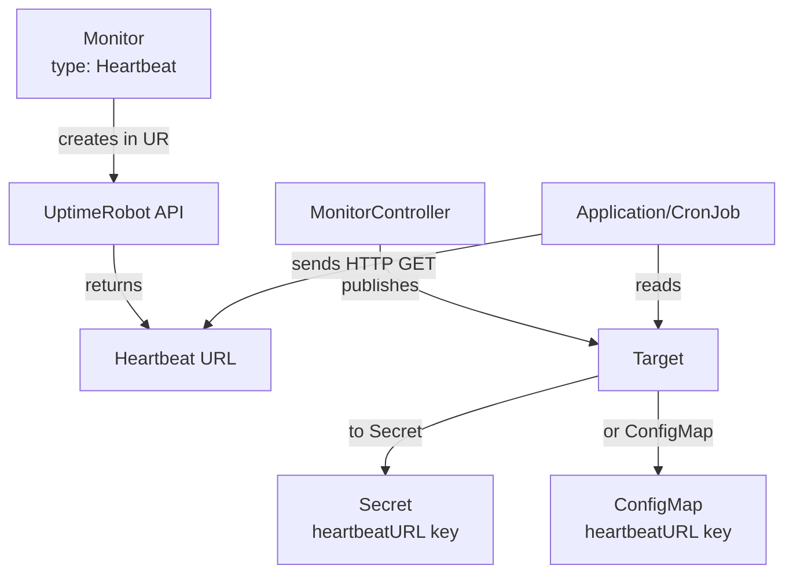

### Monitor Adoption

Adopting existing monitors preserves history and avoids duplicates:

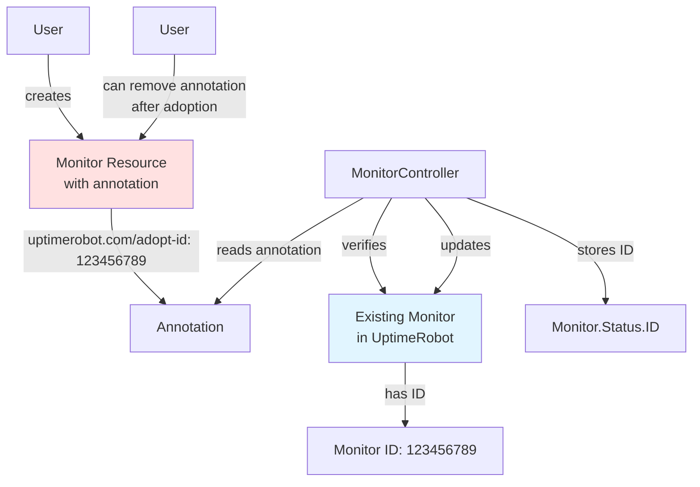

## Webhook Configuration

The operator currently uses validating webhooks (no mutating/defaulting webhook):

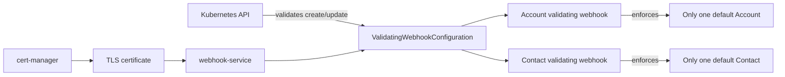

### Certificate Management

- Certificates are managed by cert-manager (dependency)
- Auto-renewal before expiration
- Webhook unavailable if certificate invalid
- See [Troubleshooting](troubleshooting.md#webhook-certificate-issues) for issues

## Namespace Scope

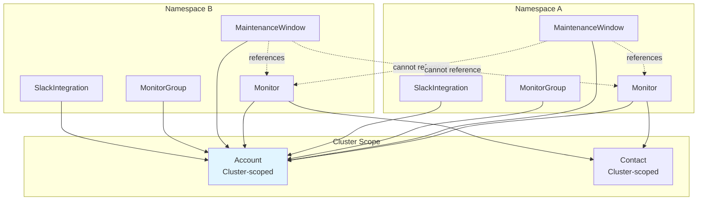

**Key Points:**
- Account and Contact are cluster-scoped (shared across namespaces)
- Monitor, MaintenanceWindow, MonitorGroup, and SlackIntegration are namespace-scoped
- Cross-namespace references are not supported for namespaced resources
- MaintenanceWindow can only reference Monitors in the same namespace

## Status Fields

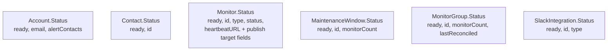

This project does **not** define a `status.conditions` array on these CRDs; status is represented by resource-specific fields (primarily `ready` and IDs).

## See Also

- [Troubleshooting Guide](troubleshooting.md) - Diagnose and fix common issues
- [API Reference](api-reference.md) - Complete CRD field documentation
- [Getting Started](getting-started.md) - Quick start tutorial
