# Architecture

This document provides a visual overview of the Uptime Robot Operator architecture, including CRD relationships, controller interactions, and data flows.

## System Overview

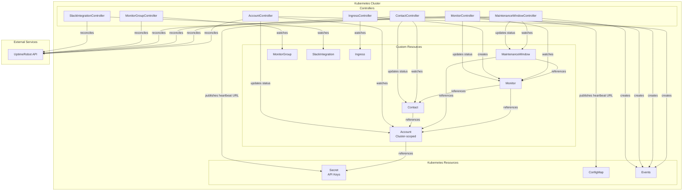

## CRD Dependency Graph

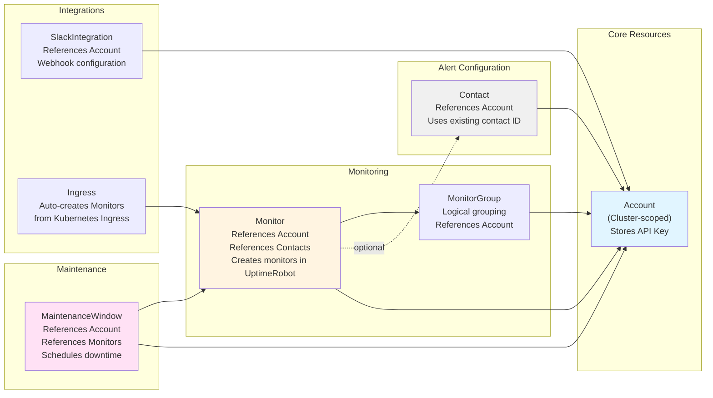

### Dependency Rules

1. **Account** must be ready before dependent resources can sync
2. **Contact** requires a ready Account and must reference an existing contact ID from the Account status
3. **Monitor** requires a ready Account; Contacts are optional but must be ready if referenced
4. **MaintenanceWindow** requires a ready Account; referenced Monitors must exist (but don't need to be ready)
5. **Ingress** controller auto-creates Monitor resources

## Reconciliation Flow

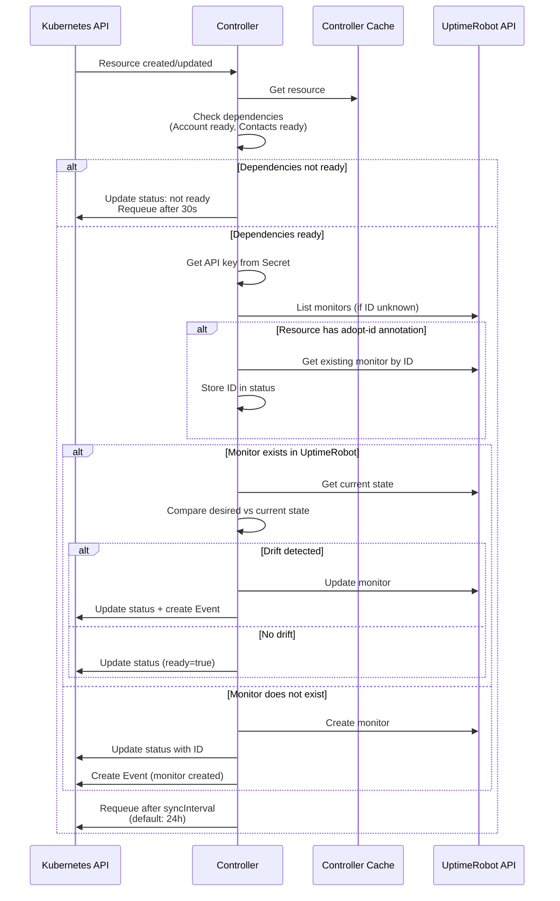

## Drift Detection

The operator continuously monitors for configuration drift between Kubernetes and UptimeRobot:

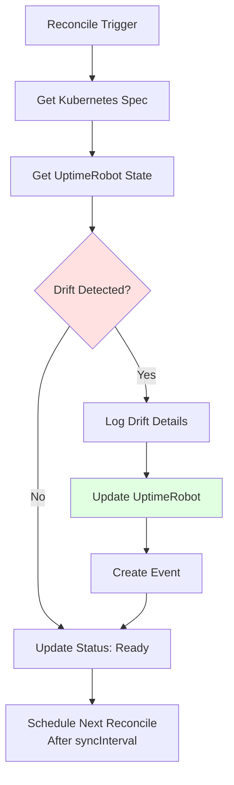

### Drift Detection Frequency

Controlled by the `syncInterval` field (default: 24h):
- Lower values = faster drift detection, more API calls
- Higher values = less API load, slower drift detection

## Finalizer and Deletion Flow

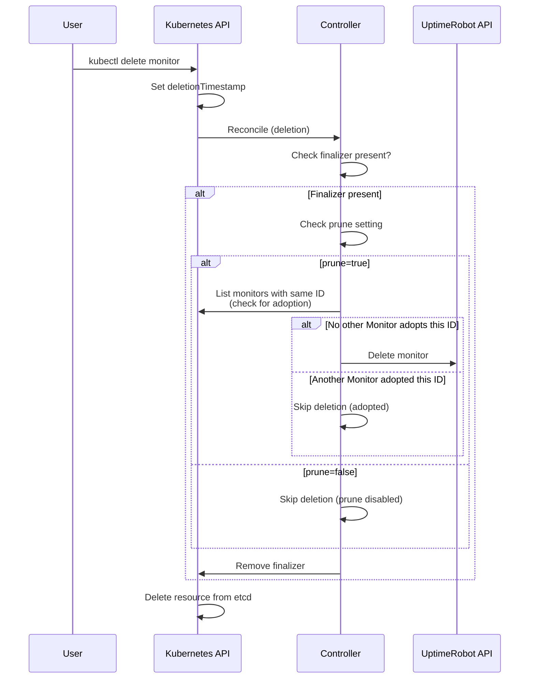

## Controller Watches

Each controller watches specific resources:

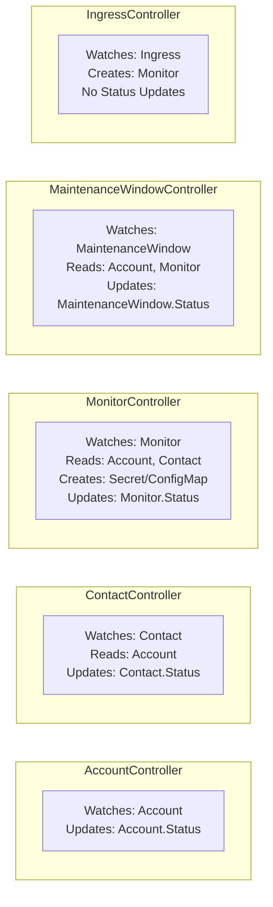

## External API Interactions

### Authentication Flow

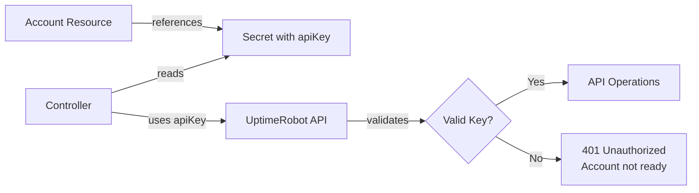

### Rate Limiting

UptimeRobot API has rate limits:
- Controllers respect rate limits automatically
- `syncInterval` controls reconciliation frequency
- Failed requests trigger exponential backoff
- Check controller logs for rate limit errors

## Component Interactions

### Heartbeat URL Publishing

For Heartbeat-type monitors, the controller publishes the generated URL:

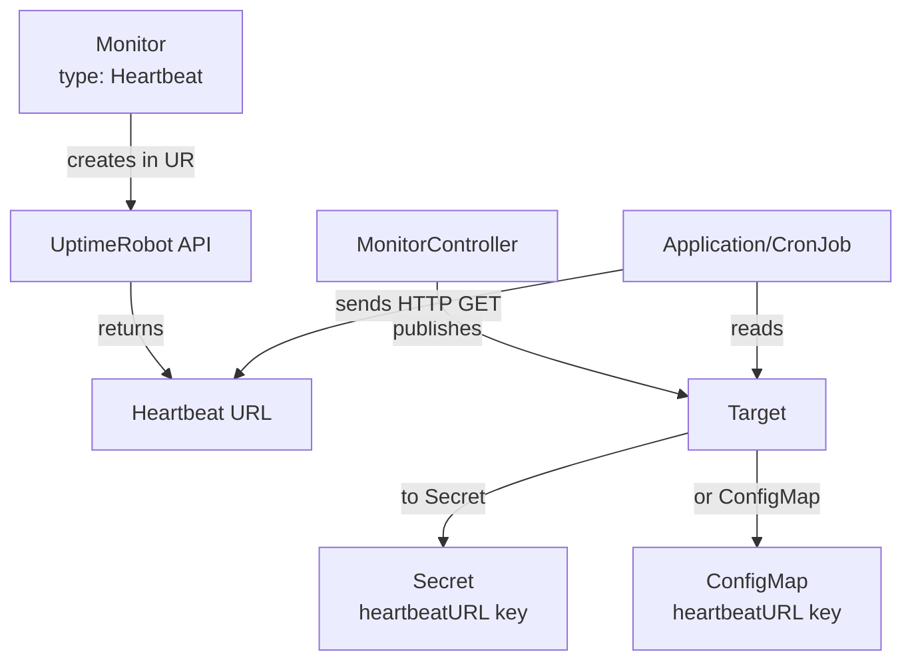

### Monitor Adoption

Adopting existing monitors preserves history and avoids duplicates:

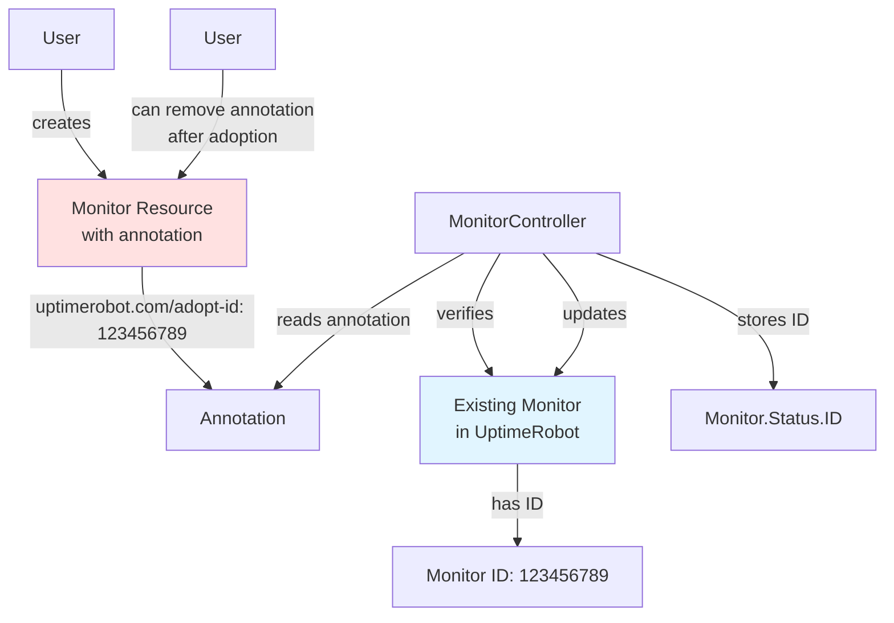

## Webhook Configuration

The operator uses webhooks for validation and defaulting:

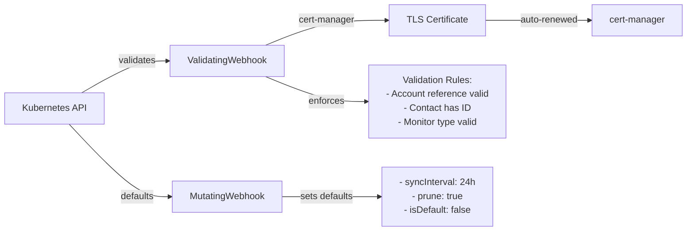

### Certificate Management

- Certificates are managed by cert-manager (dependency)
- Auto-renewal before expiration
- Webhook unavailable if certificate invalid
- See [Troubleshooting](troubleshooting.md#webhook-certificate-issues) for issues

## Namespace Scope

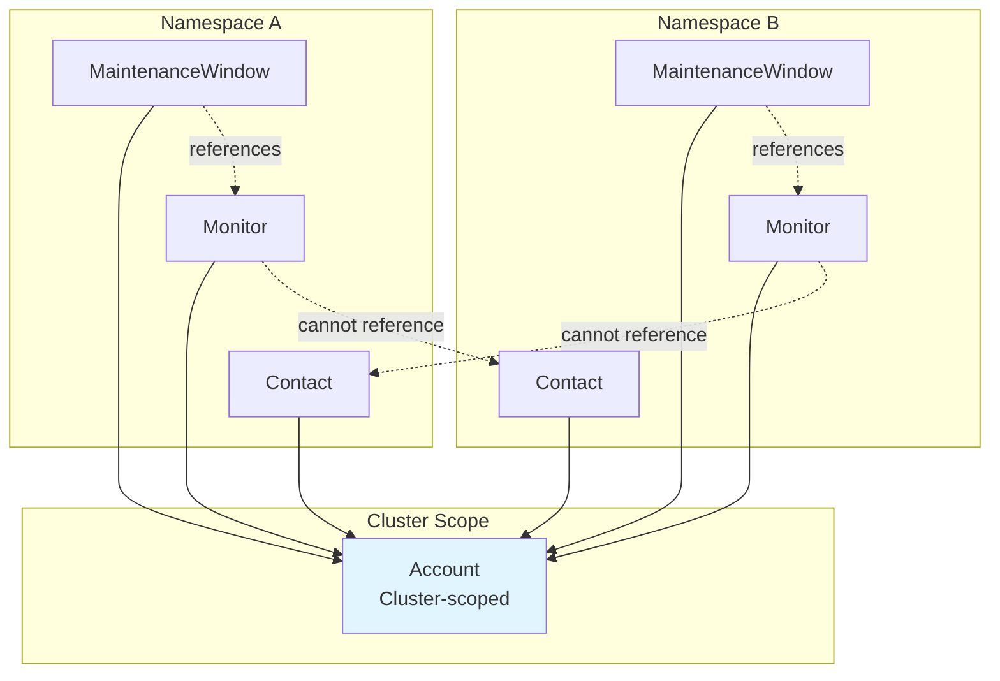

**Key Points:**
- Account is cluster-scoped (shared across namespaces)
- Monitor, Contact, MaintenanceWindow are namespace-scoped
- Cross-namespace references are not supported (except to Account)
- MaintenanceWindow can only reference Monitors in the same namespace

## Status Conditions

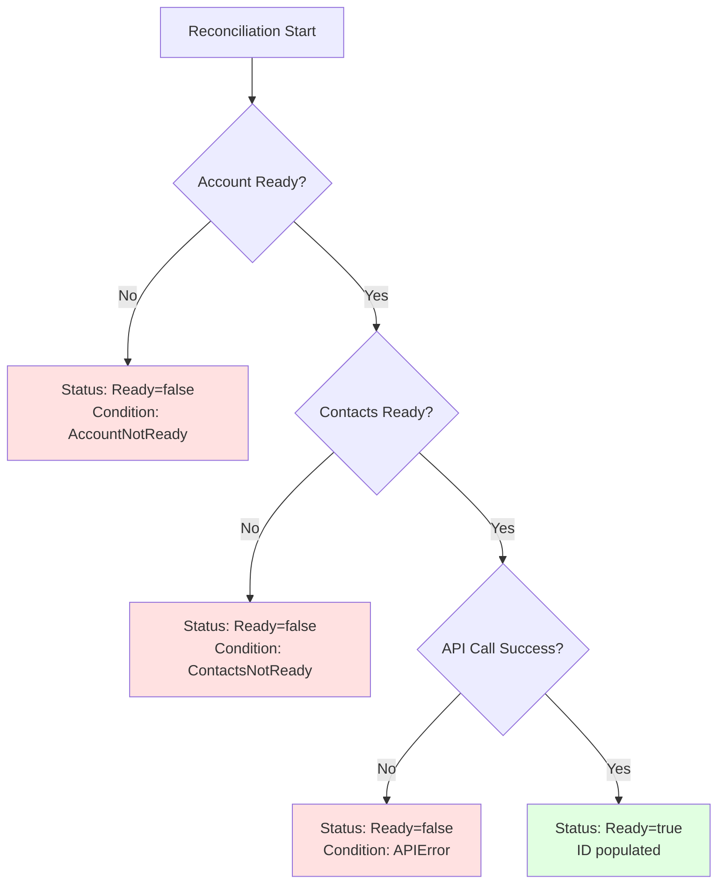

## See Also

- [Troubleshooting Guide](troubleshooting.md) - Diagnose and fix common issues
- [API Reference](api-reference.md) - Complete CRD field documentation
- [Getting Started](getting-started.md) - Quick start tutorial
